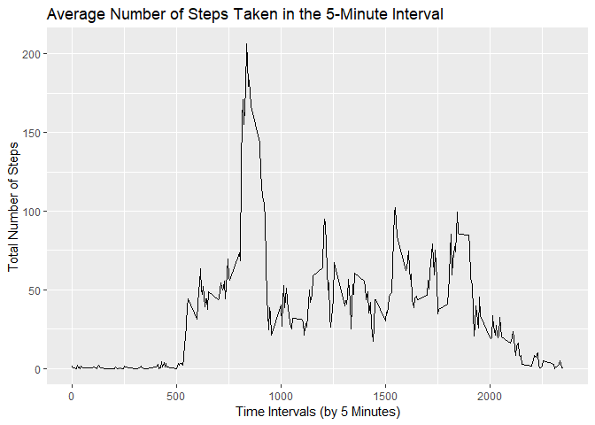
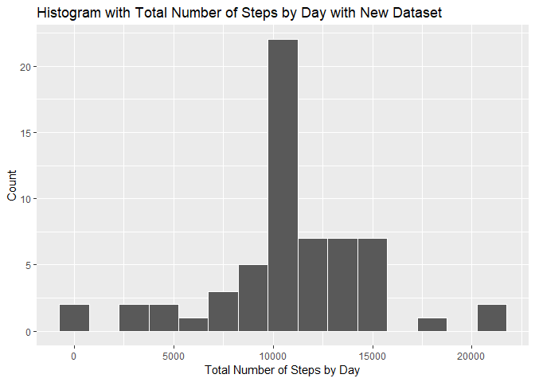
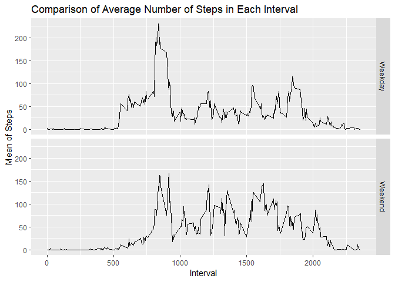

## R Markdown

This is an R Markdown document. Markdown is a simple formatting syntax for authoring HTML, PDF, and MS Word documents. For more details on using R Markdown see <http://rmarkdown.rstudio.com>.

When you click the **Knit** button a document will be generated that includes both content as well as the output of any embedded R code chunks within the document. You can embed an R code chunk like this:


## Loading and preprocessing the data
Set the working directory and load data into a data frame `load_data`.  


```r
setwd("F:/Coursera/Course-5/repdata_data_activity")
load_data <- read.csv("activity.csv")
summary(load_data)
```

```
##      steps                date          interval     
##  Min.   :  0.00   2012-10-01:  288   Min.   :   0.0  
##  1st Qu.:  0.00   2012-10-02:  288   1st Qu.: 588.8  
##  Median :  0.00   2012-10-03:  288   Median :1177.5  
##  Mean   : 37.38   2012-10-04:  288   Mean   :1177.5  
##  3rd Qu.: 12.00   2012-10-05:  288   3rd Qu.:1766.2  
##  Max.   :806.00   2012-10-06:  288   Max.   :2355.0  
##  NA's   :2304     (Other)   :15840
```
## What is mean total number of steps taken per day?
1. Calculate the total number of steps taken per day
2. Make a histogram of the total number of steps taken each day
3. Calculate and report the mean and median of the total number of steps taken per day

```r
steps_by_day <- aggregate(steps ~ date, load_data, sum)
hist(steps_by_day$steps, main = paste("Total Steps Each Day"), col="blue", xlab="Number of Steps")
```

<!-- -->

```r
rmean <- mean(steps_by_day$steps)
rmedian <- median(steps_by_day$steps)
```


## What is the average daily activity pattern?
1.  Make a time series plot (i.e. \color{red}{\verb|type = "l"|}type="l") of the 5-minute interval (x-axis) and the average number of steps taken, averaged across all days (y-axis)


```r
library(ggplot2)
five_min_interval <- aggregate(steps ~ interval, data = load_data, FUN =mean)
TimeSeries1 <- ggplot(data = five_min_interval, aes(x = interval, y = steps)) + 
    geom_line() +
    xlab("Time Intervals (by 5 Minutes)") + 
    ylab("Total Number of Steps") +
    ggtitle("Average Number of Steps Taken in the 5-Minute Interval")
print(TimeSeries1)
```

<!-- -->

2. Which 5-minute interval, on average across all the days in the dataset, contains the maximum number of steps?

```r
five_min_interval[which(five_min_interval$steps == max(five_min_interval$steps)),]
```

<div data-pagedtable="false">
  <script data-pagedtable-source type="application/json">
{"columns":[{"label":[""],"name":["_rn_"],"type":[""],"align":["left"]},{"label":["interval"],"name":[1],"type":["int"],"align":["right"]},{"label":["steps"],"name":[2],"type":["dbl"],"align":["right"]}],"data":[{"1":"835","2":"206.1698","_rn_":"104"}],"options":{"columns":{"min":{},"max":[10]},"rows":{"min":[10],"max":[10]},"pages":{}}}
  </script>
</div>

## Imputing missing values
Calculate and report the total number of missing values in the dataset (i.e. the total number of rows with \color{red}{\verb|NA|}NAs)


```r
sapply(X = load_data, FUN = function(x) sum(is.na(x)))
```

```
##    steps     date interval 
##     2304        0        0
```

Devise a strategy for filling in all of the missing values in the dataset. The strategy does not need to be sophisticated. For example, you could use the mean/median for that day, or the mean for that 5-minute interval, etc.


```r
library(dplyr)
```

```
## 
## Attaching package: 'dplyr'
```

```
## The following objects are masked from 'package:stats':
## 
##     filter, lag
```

```
## The following objects are masked from 'package:base':
## 
##     intersect, setdiff, setequal, union
```

```r
replace_vals <- function(num) replace(num, is.na(num), mean(num, na.rm = TRUE))
meanday <- (load_data %>% group_by(interval) %>% mutate(steps = replace_vals(steps)))
head(meanday)
```

<div data-pagedtable="false">
  <script data-pagedtable-source type="application/json">
{"columns":[{"label":["steps"],"name":[1],"type":["dbl"],"align":["right"]},{"label":["date"],"name":[2],"type":["fctr"],"align":["left"]},{"label":["interval"],"name":[3],"type":["int"],"align":["right"]}],"data":[{"1":"1.7169811","2":"2012-10-01","3":"0"},{"1":"0.3396226","2":"2012-10-01","3":"5"},{"1":"0.1320755","2":"2012-10-01","3":"10"},{"1":"0.1509434","2":"2012-10-01","3":"15"},{"1":"0.0754717","2":"2012-10-01","3":"20"},{"1":"2.0943396","2":"2012-10-01","3":"25"}],"options":{"columns":{"min":{},"max":[10]},"rows":{"min":[10],"max":[10]},"pages":{}}}
  </script>
</div>

  verify if all nas are replaced. The following should return 0 as there is no NAs.

```r
sum(is.na(meanday))
```

```
## [1] 0
```


Create a new dataset that is equal to the original dataset but with the missing data filled in.

```r
new_datasetframe <- as.data.frame(meanday)
head(new_datasetframe)
```

<div data-pagedtable="false">
  <script data-pagedtable-source type="application/json">
{"columns":[{"label":[""],"name":["_rn_"],"type":[""],"align":["left"]},{"label":["steps"],"name":[1],"type":["dbl"],"align":["right"]},{"label":["date"],"name":[2],"type":["fctr"],"align":["left"]},{"label":["interval"],"name":[3],"type":["int"],"align":["right"]}],"data":[{"1":"1.7169811","2":"2012-10-01","3":"0","_rn_":"1"},{"1":"0.3396226","2":"2012-10-01","3":"5","_rn_":"2"},{"1":"0.1320755","2":"2012-10-01","3":"10","_rn_":"3"},{"1":"0.1509434","2":"2012-10-01","3":"15","_rn_":"4"},{"1":"0.0754717","2":"2012-10-01","3":"20","_rn_":"5"},{"1":"2.0943396","2":"2012-10-01","3":"25","_rn_":"6"}],"options":{"columns":{"min":{},"max":[10]},"rows":{"min":[10],"max":[10]},"pages":{}}}
  </script>
</div>

Summary of the new dataset

```r
summary(new_datasetframe)
```

```
##      steps                date          interval     
##  Min.   :  0.00   2012-10-01:  288   Min.   :   0.0  
##  1st Qu.:  0.00   2012-10-02:  288   1st Qu.: 588.8  
##  Median :  0.00   2012-10-03:  288   Median :1177.5  
##  Mean   : 37.38   2012-10-04:  288   Mean   :1177.5  
##  3rd Qu.: 27.00   2012-10-05:  288   3rd Qu.:1766.2  
##  Max.   :806.00   2012-10-06:  288   Max.   :2355.0  
##                   (Other)   :15840
```

Make a histogram of the total number of steps taken each day and Calculate and report the mean and median total number of steps taken per day. 

```r
new_datasetframesteps <- aggregate(new_datasetframe$steps, by = list(new_datasetframe$date), FUN = sum)
names(new_datasetframesteps)[names(new_datasetframesteps) == "x"] <- "Total"
names(new_datasetframesteps)[names(new_datasetframesteps) == "Group.1"] <- "Date"
hist2 <- ggplot(data = new_datasetframesteps, aes(Total)) + 
    geom_histogram(binwidth = 1500, colour = "white") +
    xlab("Total Number of Steps by Day") +
    ylab("Count") +
    ggtitle("Histogram with Total Number of Steps by Day with New Dataset")
print(hist2)
```

<!-- -->

Do these values differ from the estimates from the first part of the assignment? What is the impact of imputing missing data on the estimates of the total daily number of steps?  Let us compare two plots.


```r
mean(new_datasetframesteps$Total)
```

```
## [1] 10766.19
```

```r
median(new_datasetframesteps$Total)
```

```
## [1] 10766.19
```

We can see the mean of each data set are same, and median is slightly different but closer.


## Are there differences in activity patterns between weekdays and weekends?

Create a new factor variable in the dataset with two levels – “weekday” and “weekend” indicating whether a given date is a weekday or weekend day.


```r
new_datasetframe$WeekendOrWeekday <- ifelse(weekdays(as.Date(new_datasetframe$date)) %in% c("Monday", "Tuesday", "Wednesday", "Thursday", "Friday"), "Weekday", "Weekend")
head(new_datasetframe)
```

<div data-pagedtable="false">
  <script data-pagedtable-source type="application/json">
{"columns":[{"label":[""],"name":["_rn_"],"type":[""],"align":["left"]},{"label":["steps"],"name":[1],"type":["dbl"],"align":["right"]},{"label":["date"],"name":[2],"type":["fctr"],"align":["left"]},{"label":["interval"],"name":[3],"type":["int"],"align":["right"]},{"label":["WeekendOrWeekday"],"name":[4],"type":["chr"],"align":["left"]}],"data":[{"1":"1.7169811","2":"2012-10-01","3":"0","4":"Weekday","_rn_":"1"},{"1":"0.3396226","2":"2012-10-01","3":"5","4":"Weekday","_rn_":"2"},{"1":"0.1320755","2":"2012-10-01","3":"10","4":"Weekday","_rn_":"3"},{"1":"0.1509434","2":"2012-10-01","3":"15","4":"Weekday","_rn_":"4"},{"1":"0.0754717","2":"2012-10-01","3":"20","4":"Weekday","_rn_":"5"},{"1":"2.0943396","2":"2012-10-01","3":"25","4":"Weekday","_rn_":"6"}],"options":{"columns":{"min":{},"max":[10]},"rows":{"min":[10],"max":[10]},"pages":{}}}
  </script>
</div>

Make a panel plot containing a time series plot (i.e. \color{red}{\verb|type = "l"|}type="l") of the 5-minute interval (x-axis) and the average number of steps taken, averaged across all weekday days or weekend days (y-axis). See the README file in the GitHub repository to see an example of what this plot should look like using simulated data.


```r
new_datasetframe <- (new_datasetframe %>% group_by(interval, WeekendOrWeekday) %>% summarise(Mean = mean(steps)))
ggplot(new_datasetframe, mapping = aes(x = interval, y = Mean)) + geom_line() +
    facet_grid(WeekendOrWeekday ~.) + xlab("Interval") + ylab("Mean of Steps") +
    ggtitle("Comparison of Average Number of Steps in Each Interval")
```

<!-- -->

What we infer is there are differences in the activity patterns between weekdays and weekends. People are more active in weekdays.

